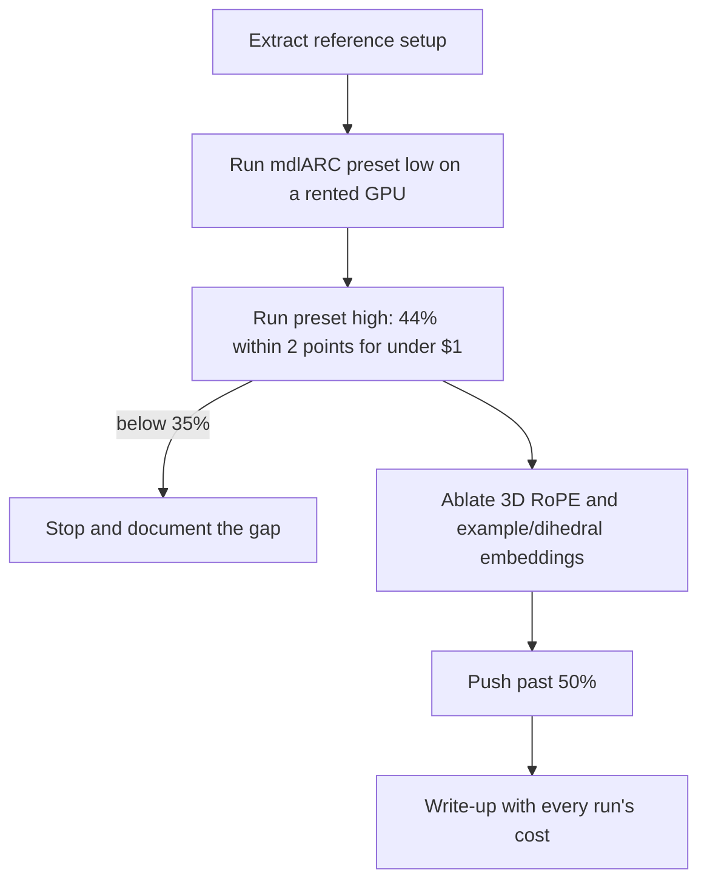
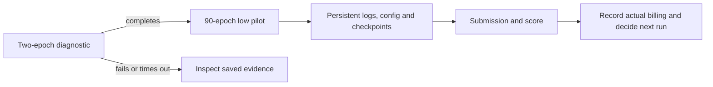
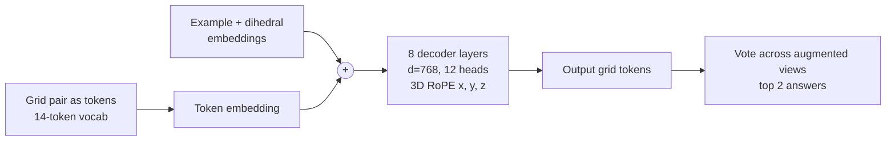

# arc-transformer

A small autoregressive transformer trained from scratch on ARC-AGI-1.

Goal: reproduce the 44% result reported for a 1.5 hour, 67 cent run, then ablate the positional encoding (3D RoPE, per-example embeddings) to pass 50% or explain why it can't.

Reference: [44% on ARC-AGI-1 in 67 cents](https://mvakde.github.io/blog/44-on-arc-1/), code at [mvakde/mdlARC](https://github.com/mvakde/mdlARC). Exact setup in [docs/REFERENCE.md](docs/REFERENCE.md).

## Plan



## Run the reference on Modal

The reference is pinned to `8afc20d`, with torch 2.9.0, CUDA 13 and
flash-attn 2.8.3. Check project spending with `python3.11 costs.py --by-run`
in `../experiment-hub` before launching. The project has a $5 lifetime budget;
the $0.67 reference cost used a different GPU and provider.

```bash
ARC_RUN=probe-h100-20261009-003 modal run modal_app.py --diagnostic
ARC_RUN=low-h100-20261009-003 modal run modal_app.py --preset low
```

The diagnostic trains two epochs on an H100 and skips evaluation. The low
preset trains 90 epochs and scores the reference's full evaluation set.
One seed is exploratory; the low preset does not reproduce the high preset's
44% claim.

Each run has a unique directory in the `arc-transformer-runs` volume:
`summary.json`, a streamed `log.txt`, and `artifacts/` containing the effective
configuration, training log, checkpoints and, for a finished baseline, the
submission and structured `score.json`. Logs are committed every 60 seconds
and at exit. A hard termination can lose at most the uncommitted tail.
Intermediate checkpoints are written every ten epochs. They are evidence for
recovery; resuming is not yet exposed by this runner.

The diagnostic stops internally after seven minutes and the low run after
30 minutes, with two extra minutes reserved for finalization before Modal's
hard timeout. Failures, timeouts and missing scores are reported explicitly.
Only the low preset is enabled within the current budget. Actual spending
comes from Modal billing with `project` and `run` tags, including CPU and RAM.



Local failure-path checks: `python3.11 -m unittest discover -s tests -v`.

## Model at a glance


