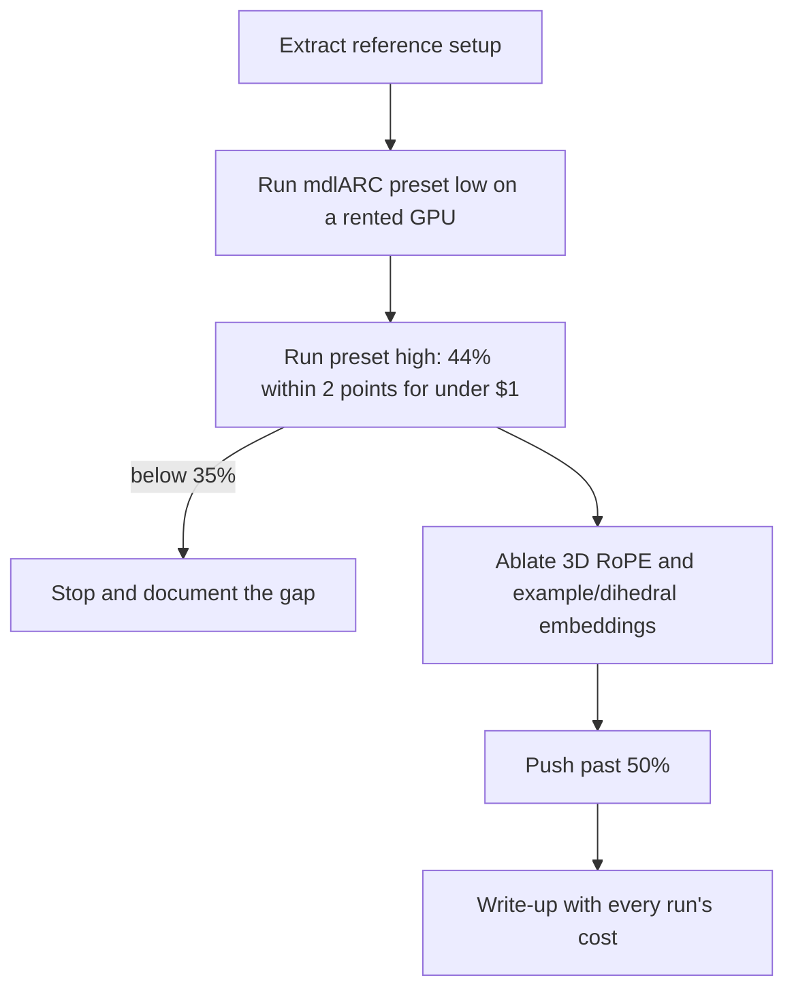
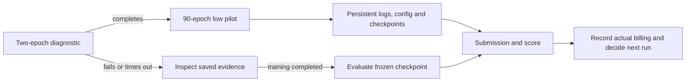
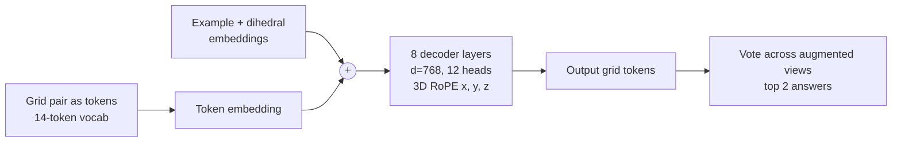

# arc-transformer

A small autoregressive transformer trained from scratch on ARC-AGI-1.

Goal: reproduce the 44% result reported for a 1.5 hour, 67 cent run, then ablate the positional encoding (3D RoPE, per-example embeddings) to pass 50% or explain why it can't.

Reference: [44% on ARC-AGI-1 in 67 cents](https://mvakde.github.io/blog/44-on-arc-1/), code at [mvakde/mdlARC](https://github.com/mvakde/mdlARC). Exact setup in [docs/REFERENCE.md](docs/REFERENCE.md).

## Plan



## Run the reference on Modal

The reference is pinned to `8afc20d`, with torch 2.9.0, CUDA 13 and
flash-attn 2.8.3. Check project spending with `python3.11 costs.py --by-run`
in `../experiment-hub` before launching. The project has a $5 lifetime budget;
the $0.67 reference cost used a different GPU and provider.

```bash
ARC_RUN=probe-h100-20261009-003 modal run modal_app.py --diagnostic
ARC_RUN=low-h100-20261009-003 modal run modal_app.py --preset low
# Authorized high reproduction, survives client disconnection:
ARC_RUN=high-h100-20261009-001 modal run --detach modal_app.py --preset high
# Recover evaluation from a completed training checkpoint without retraining:
ARC_RUN=eval-low-h100-20261009-003 modal run modal_app.py --evaluate-from low-h100-20261009-003
```

The diagnostic trains two epochs on an H100 and skips evaluation. The low
preset trains 90 epochs and scores the reference's full evaluation set.
One seed is exploratory; the low preset does not reproduce the high preset's
44% claim.

Each run has a unique directory in the `arc-transformer-runs` volume:
`summary.json`, a streamed `log.txt`, and `artifacts/` containing the effective
configuration, training log, checkpoints and, for a finished baseline, the
submission and structured `score.json`. Logs are committed every 60 seconds
and at exit. A hard termination can lose at most the uncommitted tail.
Low intermediate checkpoints are written every ten epochs. They are evidence for
recovery; resuming is not yet exposed by this runner.

The diagnostic stops internally after seven minutes and the low run after
30 minutes, with two extra minutes reserved for finalization before Modal's
hard timeout. Failures, timeouts and missing scores are reported explicitly.
Checkpoint-only evaluation has a 15-minute inner deadline. It verifies the
source training dose and data hashes before loading the frozen checkpoint.
The high preset is authorized for one run up to $9. It trains 650 epochs
with 300 augmentations and evaluates checkpoint 648, preserving the reference
checkpoints 645/648/650 plus recovery checkpoints every 100 epochs. Its inner
deadline is 121 minutes, Modal's hard timeout is 123 minutes, and startup is
limited to two minutes. CPU and RAM are capped at four cores and 16 GiB. At
the current requested-resource rates, this reserves about $8.90 in compute;
actual billing remains the source of truth. It runs with one container and
no function retries. Data fingerprints must match the frozen low pilot before
training begins. The 15-minute recovery function accepts low checkpoints.
The high recovery function has a separate 38-minute deadline, four-core/16 GiB
hard limits, and checks the full high training dose before selecting 648.

For the 2026-10-10 high evaluation recovery, deploy the code and submit a
spawned call whose ID is saved before the caller exits:

```bash
ARC_RUN=eval-high-h100-20261010-001 modal deploy --name arc-transformer-recovery modal_app.py
python submit_evaluation.py --deployment arc-transformer-recovery \
  --run-id eval-high-h100-20261010-001 --source-run-id high-h100-20261009-001 \
  --output docs/runs/eval-high-h100-20261010-001/job.json
```

Use the Python environment containing Modal for submission. Result retrieval
uses `modal.FunctionCall.from_id(call_id).get(timeout=...)` from another
process. Deployment has no warm containers; only the submitted evaluation
uses compute. See [Modal invocation methods](https://modal.com/docs/guide/invoking-functions).
This recovery reserves about $2.99 at its full timeout, fitting within the
original high run's $9 allowance after its $5.85 billed interrupted attempt.

Actual spending
comes from Modal billing with `project` and `run` tags, including CPU and RAM.

The runner also records runtime package versions, per-epoch timings and a data
manifest with SHA-256 hashes. It checks that evaluation test outputs are absent
from `challenges.json`; demonstration outputs remain available, as required by
the reference's transductive protocol. The upstream downloader uses moving
dataset branches, so preserving the cached Modal image and data hashes matters
in addition to pinning the code commit.



Local failure-path checks: `python3.11 -m unittest discover -s tests -v`.
The test environment must include the Modal client for submission tests.

## High reproduction result (2026-10-10)

**42.75% task-averaged pass@2**, 171/400, with 169 tasks fully solved. The
fixed seed-42 high preset trained 650 epochs with up to 300 augmented views
and evaluated **checkpoint 648** on the full 400-task public set. Independent
rescoring confirms every task ID, all 419 test pairs, the exact score and the
frozen solutions fingerprint. The point result is 1.25 percentage points below
the reported 44%, inside the pre-specified two-point operational tolerance.

Training completed in 4,025.66 seconds (67.09 minutes). The initial evaluation
received a cancellation signal after batch 546/1008; its initiating actor is
unknown. All checkpoints survived. A deployed, spawned evaluation call used
the same frozen checkpoint without retraining and completed all 1008 batches
in 1,194.29 seconds of evaluation. The deployment was stopped after collecting
the result.

Reported tagged compute consumption: **$5.85282058** for the interrupted
initial run plus **$1.46032402** for recovery, **$7.31314460 combined**, within
the approved $9 reserve. Billing snapshots can be updated as metering data
arrives. The account snapshot shows zero monetary billed cost after credits.
This does not meet the research goal of under-$1 compute consumption.

| Preset | Epochs / views | Task-averaged pass@2 | Fully solved tasks |
|---|---|---:|---:|
| low | 90 / 80 | 33.875% | 134 |
| high | 650 / 300 | 42.75% | 169 |

The observed difference is 8.875 percentage points. Both training dose and
inference views changed; this comparison does not isolate an epoch-only gain.
There is one high training seed, so no CI over seeds or statistical equivalence
claim. The next step is a scoped controlled-ablation or seed-replication plan,
plus a cheaper execution study, before further compute.

Evidence: [training and cancellation](docs/runs/high-h100-20261009-001/),
[completed recovery and verification](docs/runs/eval-high-h100-20261010-001/).

Recheck the saved submission with `verify_submission.py`, passing the frozen
solutions file, reported score and data manifest. This verifier checks exact
task/pair coverage, both attempts, per-task partial credit and the solutions
SHA-256 before comparing the reported result.

## First completed pilot (2026-10-09)

The low preset, seed 42, scored **33.875%** on the 400-task ARC-AGI-1 public
evaluation set: task-averaged pass@2 score 135.5/400, with 134 tasks fully
correct. The scorer gives partial credit within tasks with multiple test
pairs. All 400 task IDs and all 419 test pairs are present in the submission;
an independent JSON rescore matches the reference scorer exactly.

Training completed 90 epochs in 640.67 seconds on H100. A logging-adapter
error interrupted the evaluation handoff; the final checkpoint was retained
and evaluated without retraining in 401.98 seconds. The combined subprocess
time was 1,107.4 seconds, including setup and the failed handoff. The adapter
is fixed and a regression test protects its evaluation arguments.

| Evidence | Location |
|---|---|
| Two-epoch diagnostic | [docs/runs/probe-h100-20261009-004](docs/runs/probe-h100-20261009-004/) |
| Full training, config and checkpoints log | [docs/runs/low-h100-20261009-003](docs/runs/low-h100-20261009-003/) |
| Recovered evaluation, submission and independent verification | [docs/runs/eval-low-h100-20261009-003](docs/runs/eval-low-h100-20261009-003/) |

This is one exploratory seed with the low preset. It does not confirm the
high preset's 44% claim or estimate seed-to-seed uncertainty. No architecture
or hyperparameter ablations were performed. Actual billing for these runs is
pending in Modal's report; the confirmed prior app spending is $1.52424669.
The low session apps are stopped. The next milestone is the authorized
high-preset reproduction described above.

## Model at a glance


