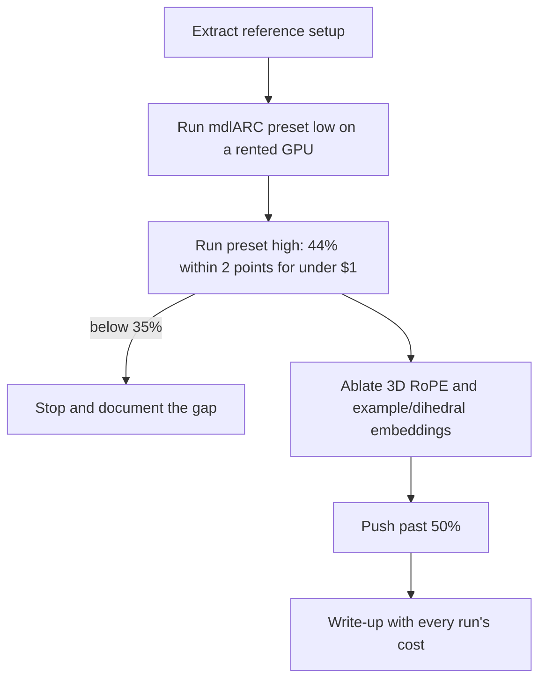
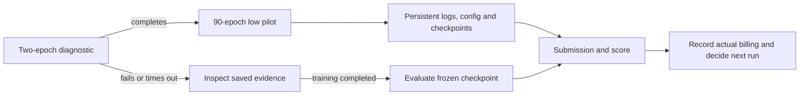
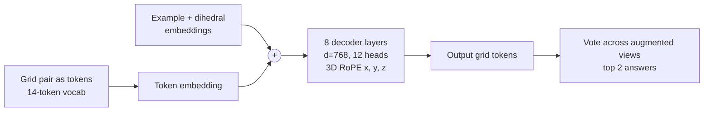

# arc-transformer

A small autoregressive transformer trained from scratch on ARC-AGI-1.

Goal: reproduce the 44% result reported for a 1.5 hour, 67 cent run, then ablate the positional encoding (3D RoPE, per-example embeddings) to pass 50% or explain why it can't.

Reference: [44% on ARC-AGI-1 in 67 cents](https://mvakde.github.io/blog/44-on-arc-1/), code at [mvakde/mdlARC](https://github.com/mvakde/mdlARC). Exact setup in [docs/REFERENCE.md](docs/REFERENCE.md).

## Plan



## Run the reference on Modal

The reference is pinned to `8afc20d`, with torch 2.9.0, CUDA 13 and
flash-attn 2.8.3. Check project spending with `python3.11 costs.py --by-run`
in `../experiment-hub` before launching. The project has a $5 lifetime budget;
the $0.67 reference cost used a different GPU and provider.

```bash
ARC_RUN=probe-h100-20261009-003 modal run modal_app.py --diagnostic
ARC_RUN=low-h100-20261009-003 modal run modal_app.py --preset low
# Recover evaluation from a completed training checkpoint without retraining:
ARC_RUN=eval-low-h100-20261009-003 modal run modal_app.py --evaluate-from low-h100-20261009-003
```

The diagnostic trains two epochs on an H100 and skips evaluation. The low
preset trains 90 epochs and scores the reference's full evaluation set.
One seed is exploratory; the low preset does not reproduce the high preset's
44% claim.

Each run has a unique directory in the `arc-transformer-runs` volume:
`summary.json`, a streamed `log.txt`, and `artifacts/` containing the effective
configuration, training log, checkpoints and, for a finished baseline, the
submission and structured `score.json`. Logs are committed every 60 seconds
and at exit. A hard termination can lose at most the uncommitted tail.
Intermediate checkpoints are written every ten epochs. They are evidence for
recovery; resuming is not yet exposed by this runner.

The diagnostic stops internally after seven minutes and the low run after
30 minutes, with two extra minutes reserved for finalization before Modal's
hard timeout. Failures, timeouts and missing scores are reported explicitly.
Checkpoint-only evaluation has a 15-minute inner deadline. It verifies the
source training dose and data hashes before loading the frozen checkpoint.
Only the low preset is enabled within the current budget. Actual spending
comes from Modal billing with `project` and `run` tags, including CPU and RAM.

The runner also records runtime package versions, per-epoch timings and a data
manifest with SHA-256 hashes. It checks that evaluation test outputs are absent
from `challenges.json`; demonstration outputs remain available, as required by
the reference's transductive protocol. The upstream downloader uses moving
dataset branches, so preserving the cached Modal image and data hashes matters
in addition to pinning the code commit.



Local failure-path checks: `python3.11 -m unittest discover -s tests -v`.

## First completed pilot (2026-10-09)

The low preset, seed 42, scored **33.875%** on the 400-task ARC-AGI-1 public
evaluation set: task-averaged pass@2 score 135.5/400, with 134 tasks fully
correct. The scorer gives partial credit within tasks with multiple test
pairs. All 400 task IDs and all 419 test pairs are present in the submission;
an independent JSON rescore matches the reference scorer exactly.

Training completed 90 epochs in 640.67 seconds on H100. A logging-adapter
error interrupted the evaluation handoff; the final checkpoint was retained
and evaluated without retraining in 401.98 seconds. The combined subprocess
time was 1,107.4 seconds, including setup and the failed handoff. The adapter
is fixed and a regression test protects its evaluation arguments.

| Evidence | Location |
|---|---|
| Two-epoch diagnostic | [docs/runs/probe-h100-20261009-004](docs/runs/probe-h100-20261009-004/) |
| Full training, config and checkpoints log | [docs/runs/low-h100-20261009-003](docs/runs/low-h100-20261009-003/) |
| Recovered evaluation, submission and independent verification | [docs/runs/eval-low-h100-20261009-003](docs/runs/eval-low-h100-20261009-003/) |

This is one exploratory seed with the low preset. It does not confirm the
high preset's 44% claim or estimate seed-to-seed uncertainty. No architecture
or hyperparameter ablations were performed. Actual billing for these runs is
pending in Modal's report; the confirmed prior app spending is $1.52424669.
All session apps are stopped. The next milestone is a budgeted high-preset
reproduction, after actual billing is available.

## Model at a glance


