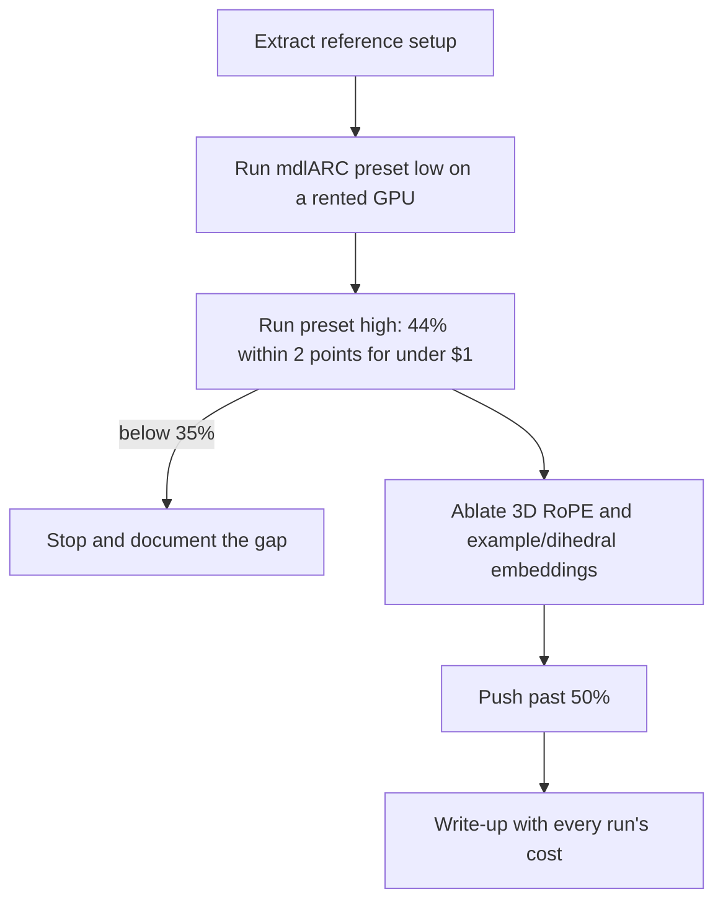
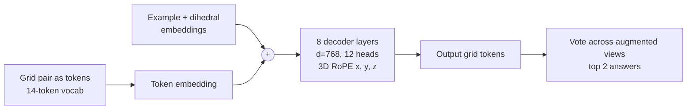

# arc-transformer

A small autoregressive transformer trained from scratch on ARC-AGI-1.

Goal: reproduce the 44% result reported for a 1.5 hour, 67 cent run, then ablate the positional encoding (3D RoPE, per-example embeddings) to pass 50% or explain why it can't.

Reference: [44% on ARC-AGI-1 in 67 cents](https://mvakde.github.io/blog/44-on-arc-1/), code at [mvakde/mdlARC](https://github.com/mvakde/mdlARC). Exact setup in [docs/REFERENCE.md](docs/REFERENCE.md).

## Plan

## Model at a glance

